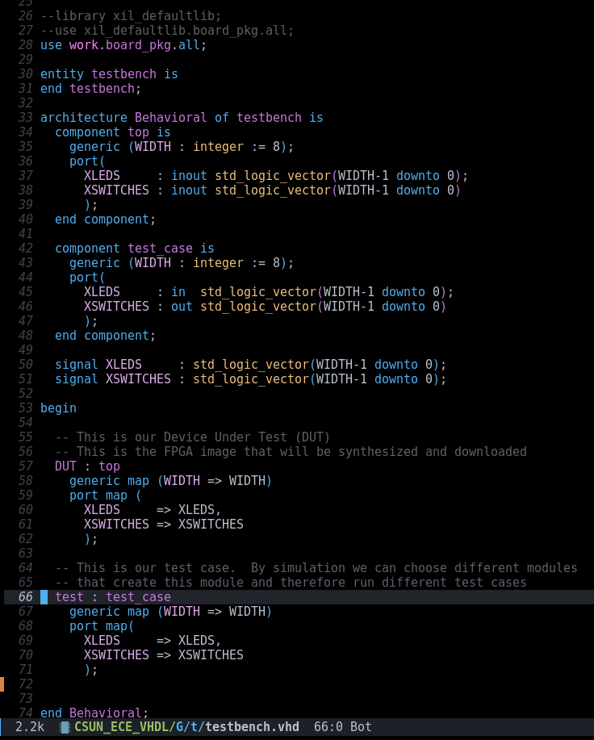
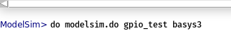
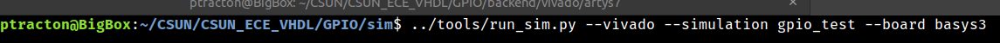
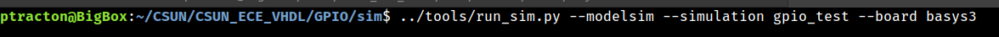
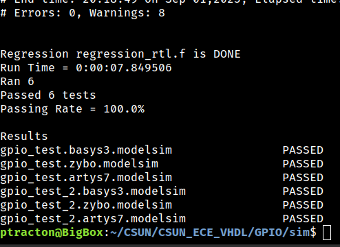

# GPIO Example

This project is a demonstration of basic GPIO operations for a Xilinx FPGA.  it is currently configured for the [Basys3 board](https://digilent.com/shop/basys-3-artix-7-fpga-trainer-board-recommended-for-introductory-users/), but porting to another board should not be a hard challenge.

## RTL
The RTL is located in the /rtl directory.  The [top.vhd](https://github.com/ptracton/CSUN_ECE_VHDL/blob/main/GPIO/rtl/top.vhd) file is the top level instance of the FPGA and has the ports for communicating with the board.  This level is instantiating and configuring the LEDS and SWITCHES instances of the GPIO logic.  It is also connecting the output from the swtiches instance to the input of the LEDS instance.  This is the path that makes the moving of the switches trigger a change in the LED operation.

The [gpio.vhd](https://github.com/ptracton/CSUN_ECE_VHDL/blob/main/GPIO/rtl/gpio/gpio.vhd) file a wrapper around the gpio\_bit.vhd file.  At this level, the WIDTH generic is used to generate this many instances of the gpio_bit.  By using a generic, this module can have as many or as few GPIO bits as needed.

The [gpio_bit.vhd](https://github.com/ptracton/CSUN_ECE_VHDL/blob/main/GPIO/rtl/gpio/gpio_bit.vhd) file has the actual bi-directional logic.

## Simulation

Both modelsim and vivado can simulate the design.  You can do either from their respective GUIs or from the command line.  The command line uses a python script, [run\_sim.py](https://github.com/ptracton/CSUN_ECE_VHDL/blob/main/GPIO/tools/run_sim.py) to execute.  There is also a [run\_regression.py](https://github.com/ptracton/CSUN_ECE_VHDL/blob/main/GPIO/tools/run_regression.py) script that can run a collection of tests and report back their performance.

### Testbench

This is where I am trying a new approach.  I want a single testbench file and to be able to swap out the actual test case logic.  I do this in verilog regularly and with ease by including the test case file in the testbench.  The simulation script copies the test case to the correct name so it is simulated.  VHDL does not support doing this, so a different approach was needed.  My solution to this was to make the testbench vrey empty.  It is just the DUT instantiated and connected to a module named test_case.

This lets me write as many test cases as I need.  Each one will be an instance of the test\_case module and can perform different actions.  Which everyone is compiled by the simulator gets executed and the results logged.  The image below shows 2 different test cases that can be executed for the GPIO module.  They are not identical, each test case can be independent.

### Tools

Modelsim and Vivado are the 2 current simulators used for this design.

### GUI Simulation

#### Vivado
Running multiple different test cases in Vivado GUI can be a challenge.  Using [multiple simulation](https://support.xilinx.com/s/article/64111?language=en_US) sets appears to be the answer but seems challenging.  All of the different test cases can be loaded into Vivado as simulation sources. By disabling the other test cases the one remaining one will be executed.

#### Modelsim
Modelsim is an easier environment to set up multiple test cases.  Modelsim is driven by a front end script that can be passed options from the command line in the GUI to swap out tests.  The script for this is [modelsim.do](https://github.com/ptracton/CSUN_ECE_VHDL/blob/main/GPIO/sim/modelsim.do).  Notice the red boxes.  The ${1} is the first command line parameter passed to this script.

To run a test case it is

do modelsim.do gpio_test

Notice that there is no file extension for the test case name.  That is because it is appended in the script to run the simulation and to configure the log file name.  You must run this from the sim directory.  If you are not in that directory you can use the cd command to navigate your way there.

The results looks like this.  The waveform viewing window is a seperate GUI element from the command and logging window.

There is a [wave.do](https://github.com/ptracton/CSUN_ECE_VHDL/blob/main/GPIO/sim/wave.do) file that controls which signals are shown in the viewer.  Saving the currently displayed signals will update the wave.do file.

### CLI Simulation

This is something not covered in any of my classes at this time.  From the command line you can run a simulation and collect the log files.  There is no GUI window to show the waveforms.  This relies much more on test cases being self checking.  It also makes it easier to run a regression and collect the results from all of the test cases ran at once.

The run_sim.py tool is very simple.  There is no actual knowledge of simulations in it.  It is fed a JSON file that tells it all the steps to take to execute the simulation.  The python file just iterates through the configuration and executes.  In the configurations directory there is [simulate\_modelsim.json](https://github.com/ptracton/CSUN_ECE_VHDL/blob/main/GPIO/configurations/simulate_modelsim.json) and [simulate\_vivado.json](https://github.com/ptracton/CSUN_ECE_VHDL/blob/main/GPIO/configurations/simulate_vivado.json).  To add a new simulation tool will require a new file in here with the name of simulation\_<NEW TOOL>.json.  The run_sim.py will need to be upated to add the option for this tool like it has for modelsim and vivado.

#### Vivado

#### Modelsim
To run a modelsim simulation just pass the modelsim command line argument and the simulation name.  Notice the simulation name still drops the .vhd.

The simulation name can be quickly and easily changed to a different test case.

### Regression

A regression is a collection of tests to prove a design is working.  The ability to run all of the self checking tests and collect the results to see if the design working is critical.  To do this, there is a tool in the tools directory, [run_regression.py](https://github.com/ptracton/CSUN_ECE_VHDL/blob/main/GPIO/tools/run_regression.py).  

To run the tool you need to feed it a list of  test cases to run through.  In the sim directory there is a file, [regression_rtl.f](https://github.com/ptracton/CSUN_ECE_VHDL/blob/main/GPIO/sim/regression_rtl.f).  it is just a list of test cases to go through.  Notice no file extension.  The run\_regression.py tool will iterate through this list and call run\_sim.py for each of the test cases.  When done it will inform the user of the number of tests ran, who passed, who failed and some statistics about it.

This command will run the regression using Modelsim

This is the result of the above command.

## Backend

The backend process is for synthesis, implementation, bit file generation and programming the board.  This can be done via the GUI or the command line.  The command line version uses a Makefile to build the image and download to the target.

The constraints directory has the single [basys3.xdc](https://github.com/ptracton/CSUN_ECE_VHDL/blob/main/GPIO/backend/constraints/basys3.xdc) file used by both the GUI and command line.

### Vivado GUI
In the backend/vivado/basys3 directory is the XPR file, [basys3.xpr](https://github.com/ptracton/CSUN_ECE_VHDL/blob/main/GPIO/backend/vivado/basys3/basys3.xpr).  This is the project file for Vivado.  This file can be loaded into Vivado and then the usual flow for generating the bit file is performed.  

From here you can synthesize, implement or make your bit file bit clicking on the red boxed items.

### Command Line Interface
In the backend/scripting/basys3 there is a [Makefile](https://github.com/ptracton/CSUN_ECE_VHDL/blob/main/GPIO/backend/scripting/basys3/Makefile).  This is the process used to build the FPGA bit file and program the board.  

To build the bit file all you need to type is "make"

The output of running the build process.

The resulting bit file is located in ./bitgen/basys3.bit.
The timing simulation is located in implementation/top\_timesim.vhd and the [SDF](https://www.vlsi-expert.com/2011/03/how-to-read-sdf-standard-delay-format.html) is located in implementation/top\_timesim.sdf.  This is the material needed for a timing simulation but that is work still TBD.

## Tools

### Simulation
+ [Modelsim](https://www.intel.com/content/www/us/en/software-kit/750637/modelsim-intel-fpgas-standard-edition-software-version-20-1.html?)
+ [Vivado](https://www.xilinx.com/products/design-tools/vivado.html)

#### Modelsim
This tool is NOT covered in any ECE class I am teaching right now.  It is a verilog/vhdl simulator from Intel.  It can be faster than Vivado for simulation.  It can load up either the Xilinx or Altera libraries for their models.  The free version has some limitations once the number of lines to simulate is too large

## TODO
+ Use [GHDL](https://github.com/ghdl/ghdl) and [GtkWave](https://gtkwave.sourceforge.net/)
+ Post implementation timing simulations
+ Trying different sizes for WIDTH and number of GPIO bits created
+ GPIO asserting an interrupt internally
+ Interface for CPU (AHB, AXI, WB, Picoblaze, other?)
+ Porting to other boards ([Zybo](https://digilent.com/reference/programmable-logic/zybo/start) or [Arty](https://digilent.com/reference/programmable-logic/arty-a7/start))
+ Port to [Altera](https://www.intel.com/content/www/us/en/products/programmable.html) and one of their boards from [Terasic](https://www.terasic.com.tw/cgi-bin/page/archive.pl?Language=English&CategoryNo=205&No=1046&PartNo=1#contents)
+ Improve run\_sim.py and run\_regression.py
