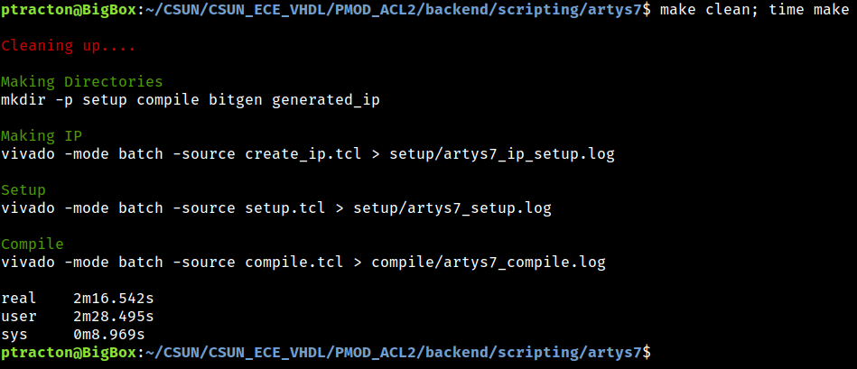

# PMOD ACL2 Example

This projected started off trying to show the [PMOD ACL2](https://digilent.com/shop/pmod-acl2-3-axis-mems-accelerometer/) and UART displaying data.  The [PMOD Hygrometer](https://digilent.com/shop/pmod-hygro-digital-humidity-and-temperature-sensor/) was added in later as a method of showing I2C and multiple modules trying to interface with the UART.

It currently builds and runs on the following boards
1. [ArtyS7](https://digilent.com/reference/programmable-logic/arty-s7/start) 
2. [Basys3](https://digilent.com/shop/basys-3-artix-7-fpga-trainer-board-recommended-for-introductory-users/)
3. [Zybo](https://digilent.com/shop/zybo-z7-zynq-7000-arm-fpga-soc-development-board/)

## RTL
The RTL is located in the /rtl directory.  The [top.vhd](https://github.com/ptracton/CSUN_ECE_VHDL/blob/main/PMOD_ACL2/rtl/top.vhd) file is the top level instance of the FPGA and has the ports for communicating with the board.  This level instantiates all of the modules.

In the rtl directory there is a sub directory for each board that this image can run on. 

In top.vhd work.board_pkg.all is brought in.  This brings in the board specific configuration into the design.  For simulation or synthesis you can only use 1 of these board files at a time.

[Digikey](https://forum.digikey.com/t/logic-design-home-table-of-contents/12507) has a page with VHDL for controlling various PMODs and other logic.  This project uses their SPI and I2C Masters inside of the ACL2 and Hygro drivers they supplied.  I did make local modifications to both to add in a data\_ready signal.  When this signal is asserted there are new outputs from the controller.

The PMOD ACL2 module does buffer up 16 samples and averages the output before sending the values to the UART so it is not printing as fast.  16 samples is probably too few since it is still very fast on the putty terminal.

The hygrometer modules reads data at a slow pace and does not FIFO up the data.  It just sends it to the UART for display.

Both the accelerometer to the UART and hygrometer to UART use the same state machine for displaying.  The difference is in the data that is loaded for processing.

## IP Catalog

This project is using 2 different blocks from the IP Catalog.  

The first is a clock wizard outputting 2 different clock frequencies.  The first primary clock is 125 (or 100) Mhz depending on the board.  Zybo is 125Mhz while Basys3 and Arty S7 are 100 Mhz.  This is used for driving most of the logic in the design.

The second clock is 10MHz on all boards.  This is used for controlling the PMODs.  CDC is handled by the second IP catalog element, dual clocked FIFO.

The FIFO generator was used to create a FIFO that is 12 bits wide, 16 elements deep, First Word Fall Through, independently clock BRAM and the counters being available.  Three of these are instantiated in the data processing module.  One for each axis of the accelerometer, X,Y and Z.  Data is written in on the PMOD Clock, 10 MHz.  Data is read using the system clock (125 or 100Mhz).  Once the FIFO is full, all the data is read out rapidly and averaged.  This value is then sent to the UART for display.

### Testbench

The testbench is using the same approach as GPIO and UART\_ECHO.  I want a single testbench file and to be able to swap out the actual test case logic.  I do this in verilog regularly and with ease by including the test case file in the testbench.  The simulation script copies the test case to the correct name so it is simulated.  VHDL does not support doing this, so a different approach was needed.  My solution to this was to make the testbench very empty.  It is just the DUT instantiated and connected to a module named test_case.

This lets me write as many test cases as I need.  Each one will be an instance of the test\_case module and can perform different actions.  Which everyone is compiled by the simulator gets executed and the results logged.  There is currently only a single test case but there is room to expand.

## Simulation

Both modelsim and vivado can simulate the design.  You can do either from their respective GUIs or from the command line.  The command line uses a python script, [run\_sim.py](https://github.com/ptracton/CSUN_ECE_VHDL/blob/main/PMOD_ACL2/tools/run_sim.py) to execute.  There is also a [run\_regression.py](https://github.com/ptracton/CSUN_ECE_VHDL/blob/main/PMOD_ACL2/tools/run_regression.py) script that can run a collection of tests and report back their performance.

The simulation is not currently self checking.  

### Tools

Modelsim and Vivado are the 2 current simulators used for this design.

### GUI Simulation

#### Vivado
Running multiple different test cases in Vivado GUI can be a challenge.  Using [multiple simulation](https://support.xilinx.com/s/article/64111?language=en_US) sets appears to be the answer but seems challenging.  All of the different test cases can be loaded into Vivado as simulation sources. By disabling the other test cases the one remaining one will be executed.

#### Modelsim

Before trying to run a simulation in the modelsim, you need to run the gen_lib.sh script at the root of this project.  This will use Vivado to create the models needed for modelsim to simulate Xilinx IP blocks like BRAM, Clock Wizard and others.  

Modelsim is an easier environment to set up multiple test cases.  Modelsim is driven by a front end script that can be passed options from the command line in the GUI to swap out tests.  The script for this is [modelsim.do](https://github.com/ptracton/CSUN_ECE_VHDL/blob/main/PMOD_ACL2/sim/modelsim.do).  Notice the red boxes.  The ${1} is the first command line parameter passed to this script.

To run a test case it is

do modelsim.do test0 basys3

Notice that there is no file extension for the test case name.  That is because it is appended in the script to run the simulation and to configure the log file name.  You must run this from the sim directory.  If you are not in that directory you can use the cd command to navigate your way there.

You also need to specify the board you are running on.  This will load up the appropriate package to configure the device.  The current choices are artys7, basys3, and zybo.

### CLI Simulation

This is something not covered in any of my classes at this time.  From the command line you can run a simulation and collect the log files.  There is no GUI window to show the waveforms.  This relies much more on test cases being self checking.  It also makes it easier to run a regression and collect the results from all of the test cases ran at once.

The run\_sim.py tool is very simple.  There is no actual knowledge of simulations in it.  It is fed a JSON file that tells it all the steps to take to execute the simulation.  The python file just iterates through the configuration and executes.  In the configurations directory there is [simulate\_modelsim.json](https://github.com/ptracton/CSUN_ECE_VHDL/blob/main/GPIO/configurations/simulate_modelsim.json) and [simulate\_vivado.json](https://github.com/ptracton/CSUN_ECE_VHDL/blob/main/GPIO/configurations/simulate_vivado.json).  To add a new simulation tool will require a new file in here with the name of simulation\_<NEW TOOL>.json.  The run_sim.py will need to be upated to add the option for this tool like it has for modelsim and vivado.

#### Vivado

#### Modelsim
To run a modelsim simulation just pass the modelsim command line argument and the simulation name.  Notice the simulation name still drops the .vhd.

The simulation name can be quickly and easily changed to a different test case.

### Regression

A regression is a collection of tests to prove a design is working.  The ability to run all of the self checking tests and collect the results to see if the design working is critical.  To do this, there is a tool in the tools directory, [run_regression.py](https://github.com/ptracton/CSUN_ECE_VHDL/blob/main/PMOD_ACL2/tools/run_regression.py).

There is only a single test case and it is not self checking.  This makes regression not useful yet.

## Backend

The backend process is for synthesis, implementation, bit file generation and programming the board.  This can be done via the GUI or the command line.  The command line version uses a Makefile to build the image and download to the target.

### Constraints

Constraints are how to tell the design to physically be connected to the board.  This is where we specify the top level IO ports from top.vhd and tell Vivado which physical IO pin to use for it.  There are [master XDC files](https://github.com/Digilent/digilent-xdc/tree/master) for each of the boards.  Use these to figure out the correct pins to connect signals to.

The constraints directory has the single [basys3.xdc](https://github.com/ptracton/CSUN_ECE_VHDL/blob/main/PMOD_ACL2/backend/constraints/basys3.xdc) file used by both the GUI and command line.  This directory has an XDC file for each of the known boards.

### Vivado GUI
In the backend/vivado/basys3 directory is the XPR file, [zybo.xpr](https://github.com/ptracton/CSUN_ECE_VHDL/blob/main/PMOD_ACL2/backend/vivado/zybo/zybo.xpr).  This is the project file for Vivado.  This file can be loaded into Vivado and then the usual flow for generating the bit file is performed.

From here you can synthesize, implement or make your bit file bit clicking on the red boxed items.

### Command Line Interface
In the backend/scripting/basys3 there is a [Makefile](https://github.com/ptracton/CSUN_ECE_VHDL/blob/main/GPIO/backend/scripting/basys3/Makefile).  This is the process used to build the FPGA bit file and program the board.

To build the bit file all you need to type is "make" to build the image.

The resulting bit file is located in ./bitgen/top.bit.
The timing simulation is located in implementation/top\_timesim.vhd and the [SDF](https://www.vlsi-expert.com/2011/03/how-to-read-sdf-standard-delay-format.html) is located in implementation/top\_timesim.sdf.  This is the material needed for a timing simulation but that is work still TBD.

There is a directory for each of the known boards that has the same Makefile and tcl files.  From here you can build the design for the specified board.

Once built, download is just "make PROGRAM"

On your putty terminal you will see something like this

Notice the data has not been converted to anything useful yet.  It is just dumping out the raw hexadecimal values.

## Tools

### Simulation
+ [Modelsim](https://www.intel.com/content/www/us/en/software-kit/750637/modelsim-intel-fpgas-standard-edition-software-version-20-1.html?)
+ [Vivado](https://www.xilinx.com/products/design-tools/vivado.html)

#### Modelsim
This tool is NOT covered in any ECE class I am teaching right now.  It is a verilog/vhdl simulator from Intel.  It can be faster than Vivado for simulation.  It can load up either the Xilinx or Altera libraries for their models.  The free version has some limitations once the number of lines to simulate is too large

## PMODS

The PMODs were put at specific locations on the board.  If you want to run this, you need to match this.

+ Arty S7, hygro on top row of JB, ACL2 on JC
+ Basys 3, hygro on top row of JB, ACL2 on JC
+ Zybo, hygro on top row of JC, ACL2 on JD

## TODO
+ Use [GHDL](https://github.com/ghdl/ghdl) and [GtkWave](https://gtkwave.sourceforge.net/)
+ Post implementation timing simulations
+ Finish writing the HDC1080 I2C Slave
+ Self Checking simulation
+ 3rd PMOD
+ Interface for CPU (AHB, AXI, WB, Picoblaze, other?)
+ Port to [Altera](https://www.intel.com/content/www/us/en/products/programmable.html) and one of their boards from [Terasic](https://www.terasic.com.tw/cgi-bin/page/archive.pl?Language=English&CategoryNo=205&No=1046&PartNo=1#contents)
+ Improve run\_sim.py and run\_regression.py
